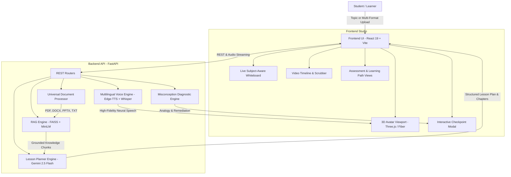

# Lilly & Co. — AI Teacher of the Future
> **A Human-Like AI Educator That Teaches Through Video, Visual Demonstrations & Adaptive Pedagogical Reasoning**

[](https://fastapi.tiangolo.com)
[](https://react.dev)
[](https://threejs.org)
[](https://deepmind.google/technologies/gemini/)
[](https://github.com/facebookresearch/faiss)
[](https://github.com/rany2/edge-tts)

---

## 1. Problem Statement
Traditional digital learning platforms either provide **static, pre-recorded lectures** (one-size-fits-all, zero adaptability) or **basic text-based chatbots** (which produce long textual monologues without visual intuition, teacher presence, or cognitive pacing). These systems lack the true pedagogical capabilities of a human teacher:
* Understanding the individual learner's level and available time.
* Delivering structured, progressive explanations through spoken voice and visual demonstrations.
* Periodically pausing to check comprehension.
* Diagnosing underlying **mental misconceptions** rather than merely marking answers right or wrong.
* Offering alternative real-world analogies to remediate confusion before advancing.

---

## 2. Solution Overview
**Lilly & Co. AI Teacher** is an end-to-end virtual educational studio that transforms any user-provided topic or uploaded document (Textbooks, PDFs, DOCX, PPTX, lecture notes, research papers) into an **immersive, interactive AI Teaching Video Experience**.

The platform implements the complete human pedagogical process:
$$\mathbf{Understand} \longrightarrow \mathbf{Plan} \longrightarrow \mathbf{Explain} \longrightarrow \mathbf{Demonstrate} \longrightarrow \mathbf{Question} \longrightarrow \mathbf{Evaluate} \longrightarrow \mathbf{Adapt} \longrightarrow \mathbf{Assess}$$

### The Core Video Classroom Experience:
1. **Interactive 3D AI Avatar**: Fully rigged 3D instructor (Lilly, Prof. Vikram, or Alex) with synchronized natural speech narration, emotive gestures, and idle breathing.
2. **Subject-Aware Dynamic Whiteboard**:
   * **Physics**: Interactive circuit lab ($V = IR$) with live sliders for Voltage & Resistance and animated electron flow; Newton's Second Law simulator.
   * **Mathematics**: Step-by-step formula derivations and interactive 2D function plotter on canvas.
   * **Biology**: Anatomical labeled cell structures with clickable organelle inspectors.
   * **Computer Science**: Live code sandbox with line-by-line execution tracing, variable inspect, and console output.
   * **History**: Interactive chronological milestones timeline.
3. **In-Lesson Interactive Checkpoints**:
   * Video pauses at key milestones for conceptual MCQs or open-ended voice/text questions.
   * Student answers by typing or speaking through Whisper STT.
4. **Cognitive Misconception Detection**:
   * Instead of a robotic "Incorrect" response, the system identifies the *exact cognitive flaw* in the student's mental model (e.g. inverting Ohm's law, confusing acceleration with velocity).
   * Generates a relatable real-world analogy (e.g. water pipe resistance, traffic jams) and provides a remedial check question.
5. **Final Assessment & Report**:
   * Post-lesson quiz with score percentage, mastery badges, weak areas ledger, actionable revision steps, confetti celebration, and suggested next topics.
6. **One-Click Video Export**:
   * Download the complete audio-visual lesson (Avatar + synchronized whiteboard + voice) as a WebM/MP4 educational video asset.

---

## 3. System Architecture



---

## 4. Key Features & Capabilities

| Requirement | Implementation in Lilly & Co. |
| :--- | :--- |
| **Document Learning & RAG** | Ingestion of **PDF, DOCX, PPTX, TXT, MD**. Chunks indexed into FAISS with `all-MiniLM-L6-v2` embeddings for zero-hallucination grounding. |
| **Topic-Based Learning** | Teaches any topic from scratch (e.g., *"Explain Quantum Superposition to a Class 8 student"*). |
| **AI Teaching Video Experience** | 3D rigged avatar speaking in sync with dynamic whiteboard visualizers, video player controls, subtitles, and downloadable WebM recording. |
| **Level Adaptation** | **Beginner** (intuitive analogies, fundamentals), **Intermediate** (practical implementations), **Advanced** (first-principles math, algorithmic rigor). |
| **Time Adaptation** | **5 Min** (Core Flash), **20 Min** (Standard Masterclass with simulation & checkpoint), **60 Min** (Deep-Dive with problem sets), **7-Day Plan** (Curriculum syllabus). |
| **Multilingual Teaching** | Seamless support for **English, Hindi (हिंदी), Hinglish (Latin Hindi), Spanish, French, Telugu, Tamil, German** with matching neural voices. |
| **Teacher Personalities** | **Lilly** (Warm & encouraging), **Prof. Vikram** (Academic & scientific rigor), **Alex** (Practical tech & lab instructor). |
| **In-Lesson Interactivity** | Pauses at chapter checkpoints for student answers (text or microphone speech). |
| **Misconception Detection** | Identifies cognitive traps, explains why intuition erred, and resets mental models using tailored real-world analogies. |
| **Learner Profile & History** | Persistent localStorage tracking: lessons completed, average mastery, weak concepts ledger, and revision triggers. |
| **AI Learning Path** | Generates multi-unit roadmaps with difficulty badges, estimated hours, and 1-click "Teach This Unit" buttons. |

---

## 5. AI/ML Models & Technologies Used

* **Large Language Model**: `Google Gemini 2.5 Flash` via `google-genai` SDK for low-latency lesson orchestration, chapter script writing, pedagogical reasoning, and misconception diagnosis.
* **Vector Embeddings**: `sentence-transformers/all-MiniLM-L6-v2` (384-dimensional dense vectors) for semantic indexing.
* **Vector Database**: `faiss-cpu` (Facebook AI Similarity Search) with `IndexFlatL2`.
* **Text-to-Speech (TTS)**: `edge-tts` utilizing high-fidelity Microsoft Neural Voices (`en-US-AriaNeural`, `en-IN-PrabhatNeural`, `hi-IN-SwaraNeural`, `te-IN-ShrutiNeural`, etc.) with browser SpeechSynthesis fallback.
* **Speech-to-Text (STT)**: `faster-whisper` (`base` model, int8 quantized on CPU) for voice answer transcription.
* **3D Graphics & Avatar**: `@react-three/fiber` and `@react-three/drei` rendering rigged glTF avatar (`lilly.glb`) with procedural bone animation.
* **Frontend UI**: React 19, Vite, Vanilla CSS design tokens with glassmorphic dark cyber-academy theme, Lucide icons, Canvas Confetti.

---

## 6. Setup & Installation Guide

### Prerequisites
* Python 3.10 to 3.13
* Node.js 18+ and npm
* Google Gemini API Key

### Step 1: Clone Repository & Configure Environment
```bash
git clone <repository_url>
cd AI-Teacher
```

In `backend/.env`, set your Gemini API key:
```env
GEMINI_API_KEY=your_gemini_api_key_here
```

### Step 2: Backend Setup
```bash
cd backend
python -m venv venv
# On Windows PowerShell:
.\venv\Scripts\Activate.ps1
# On Linux / macOS:
source venv/bin/activate

pip install -r requirements.txt
python -m uvicorn app:app --host 127.0.0.1 --port 8000 --reload
```
* Backend will be live at: `http://127.0.0.1:8000` (API documentation at `http://127.0.0.1:8000/docs`).

### Step 3: Frontend Setup
In a separate terminal:
```bash
cd frontend
npm install
npm run dev
```
* Frontend will be live at: `http://localhost:5173/`.

---

## 7. User Walkthrough & Demo Guide

1. **Launch the Web App**: Open `http://localhost:5173/` in your browser.
2. **Start a Video Lesson**:
   * Click **"Ohm's Law & Circuit Fundamentals"** on the launchpad (or click **"New Lesson"** to configure any topic, level, time, or language).
3. **Experience the AI Video Classroom**:
   * Watch the **3D Avatar** speak and gesture in sync with the live whiteboard.
   * Play with the **Voltage and Resistance sliders** on the live circuit diagram to see current and electron velocity adapt in real time.
4. **Trigger In-Lesson Concept Check**:
   * Advance to Chapter 2 to see the **Concept Check** modal interrupt the lecture.
   * Answer incorrectly on purpose (e.g. choose *"Current increases when resistance increases"*).
   * Notice the **Misconception Diagnosis**: the teacher explains the water pipe analogy and gives a remedial example!
   * Click *"Continue Video Lesson"*.
5. **Export the Lesson Video**:
   * Click **"Export Lesson Video"** in the top bar to record the canvas + avatar + whiteboard into a downloadable WebM video file.
6. **Take Final Assessment**:
   * Click **"Final Assessment & Report"** to view your score percentage, letter grade, confetti celebration, strong/weak areas, and revision plan.
7. **Curriculum Roadmap & Student Profile**:
   * Click **"Learning Path"** in the top navigation to generate a multi-module syllabus for broad topics like *Machine Learning* or *Fullstack Development*.
   * Click **"Learner Profile"** to view your cumulative study time, historical test grades, and flagged weak concepts ledger.

---

## 8. Known Limitations & Future Scope
* **WebGL on Virtualized Environments**: 3D avatar rendering requires WebGL acceleration enabled in the client browser.
* **Large PDF OCR**: Scanned image PDFs without text layers require Tesseract OCR pre-processing.
* **Future Scope**: Direct WebRTC peer connections for zero-latency duplex interruption during spoken narration.

---

## 9. Third-Party Disclosures
* Google Gemini API (`gemini-2.5-flash`)
* Microsoft Edge TTS Neural Speech (`edge-tts`)
* OpenAI Whisper via Faster-Whisper (`faster-whisper`)
* FAISS (`faiss-cpu`)
* Three.js / React Three Fiber
